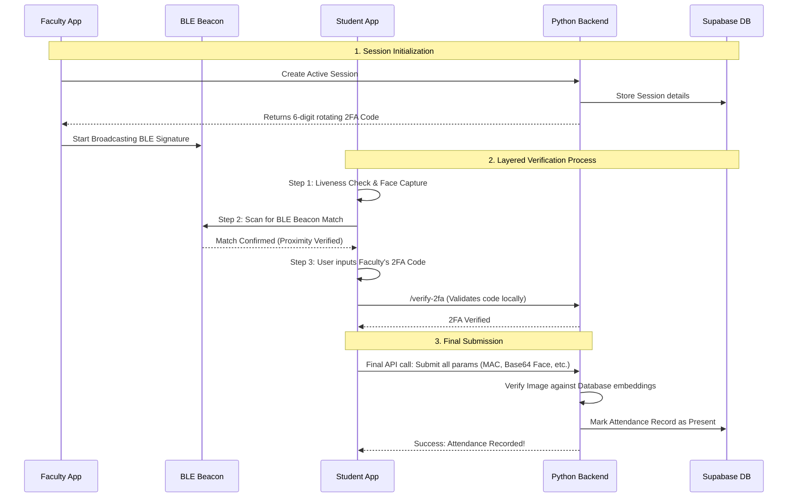

<div align="center">
  
#  Upastithi-Pramaan
### **The Elite Multi-Factor Smart Attendance Architecture**

[](https://fastapi.tiangolo.com/)
[](https://reactjs.org/)
[](https://reactnative.dev/)
[](https://supabase.com/)
[](https://www.docker.com/)

An award-winning, state-of-the-art attendance system ensuring zero-proxy through a **Four-Layered Cryptographic & Biometric Verification Engine**. Designed with an immersive, cyberpunk-inspired UI, delivering 100% feature parity across both Web Dashboard and Mobile Applications.

</div>

---

##  The Ultimate 4-Layer Verification Protocol

Proxy attendance is mathematically and physically impossible. The system verifies identity through an impenetrable **Layer-4 Architecture**:

| Layer | Technology | Security Function |
| :---: | :--- | :--- |
|  | **Liveness + Facial Recognition** | Verifies 3D liveness (Smile/Blink/Turn) and maps 128-D facial embeddings using `face_recognition` (HOG+CNN) against the Supabase secured storage. |
|  | **BLE Environmental Proximity** | Validates spatial proximity by matching emitted BLE (Bluetooth Low Energy) beacon signatures between the Faculty and Student devices. |
|  | **Rotating 2FA Cryptography** | Requires a live 6-digit Time-Based One-Time Password (TOTP) generated server-side via APScheduler, rotating every 5 minutes. |
|  | **MAC Address Whitelisting** | Confirms request origin via registered Device MAC address ensuring attendance is marked from an approved, untampered device. |

---

##  Architectural Overview

The system features a decoupled, microservices-oriented architecture using standard containerization via Docker.

<details>
<summary><b>View Sequence Flow (Mermaid diagram)</b></summary>
<br/>


</details>

---

##  Elite Web & Mobile Dashboards (100% Parity)

The client interfaces deliver a premium, fluid aesthetic utilizing **GSAP** micro-interactions on the Web and **Reanimated** on Mobile.

###  1. Student Portal
* **Automated Attendance:** One-tap initialization kicking off the 4-layer validation.
* **Attendance Ledger:** Subject-wise breakdown, historical progress bars, and calendar heatmap.
* **System Operations:** View Notifications, File Disputes, and trigger Device Change Requests.

###  2. Faculty Command Center
* **Live Session Broadcasting:** Project real-time rotating 2FA codes directly to a projector/screen.
* **Instant Roster Control:** Monitor incoming attendance matches live. Faculty override capabilities provided.
* **Deep Analytics:** 30-day class trends, dynamic defaulter lists (sub-75%), and CSV Exports (Date-ranged).

###  3. Admin Control Panel
* **Central System Health:** Monitor total enrollments, live sessions, and active API hits.
* **User & AI Management:** Perform single/bulk CSV uploads for Students & Faculty. View & trigger Face Model retrains.
* **Dispute & Device Resolutions:** One-click approvals for flagged devices and pending attendance disputes.
* **Audit Trail:** Exhaustive timeline audit logs for all systemic actions.

---

##  Technology Stack & Libraries

###  Backend Infrastructure
- **FastAPI / Uvicorn:** High-performance async Python framework.
- **Supabase (PostgreSQL / Storage):** Scalable Database and Face Image storage.
- **Python-Jose & Bcrypt:** Secure JWT role-based Auth & password hashing.
- **APScheduler:** Background daemon for synchronized TOTP code rotations.
- **Dlib & Face Recognition (Numpy):** High-accuracy ML modeling.

###  Web Client (React.js)
- **React Router DOM:** Dynamic SPA routing.
- **GSAP & ScrollTrigger:** Award-winning micro-animations, magnetic buttons, and fluid page transitions.
- **Lucide React / React Icons:** Crisp, world-class SVGs for elite visual typography.

###  Mobile Client (React Native / Expo)
- **Expo Camera:** Custom face frame alignment and liveness capture interface.
- **React Native BLE Plx:** Low-level environmental Bluetooth peripheral scanning.
- **Expo Secure Store:** Hardware-encrypted JWT keychain storage.
- **Expo Haptics:** Physical feedback mapping.

---

##  Quick Start & Deployment Guide

### Environment Preparation

You need a `SUPABASE_URL` and `SUPABASE_SERVICE_KEY`. 
Load `backend/supabase_schema.sql` into your Supabase SQL Editor.

### Method 1: Docker (Recommended)
Boot up the entire network (Backend + Frontend) instantly.
```bash
docker-compose up --build
```
> Web UI available at: `http://localhost:80`
> Backend API available at: `http://localhost:8000/docs`

### Method 2: Local Native Execution

**Terminal 1: Python Backend**
```bash
cd backend
python -m venv venv
source venv/Scripts/activate  # Or 'venv/bin/activate' on Linux/Mac
pip install -r requirements.txt
cp .env.example .env          # Setup Supabase Keys
uvicorn main:app --reload --port 8000
```

**Terminal 2: React Web Frontend**
```bash
cd frontend
npm install
npm start
```

**Terminal 3: React Native Expo Mobile App**
```bash
cd upastithi-pramaan-app
npm install
cp .env.example .env          # Set EXPO_PUBLIC_API_URL to your Local IP
npx expo start
```
*Ensure Mobile and Backend Dev Machine are connected to the same Wi-Fi network to enable local API bridging.*

---

##  Default Provisioned Roles

| Role Level | Identity Code | Default Password | Access Tier |
| :--- | :--- | :--- | :--- |
| **System Admin** | `ADMIN` | `********` | Master configuration, Dispute management, Analytics |
| **Faculty Member** | *(Add via Admin)* | `********` | Session management, Defaulter tracking, Analytics |
| **Student** | *(Enroll via Admin)* | `********` | Attendance verification, Self-tracking, Device Requests |

*(Note: Passwords are hashed in Supabase via 72-byte bcrypt salts. Please cycle defaults upon production launch.)*
